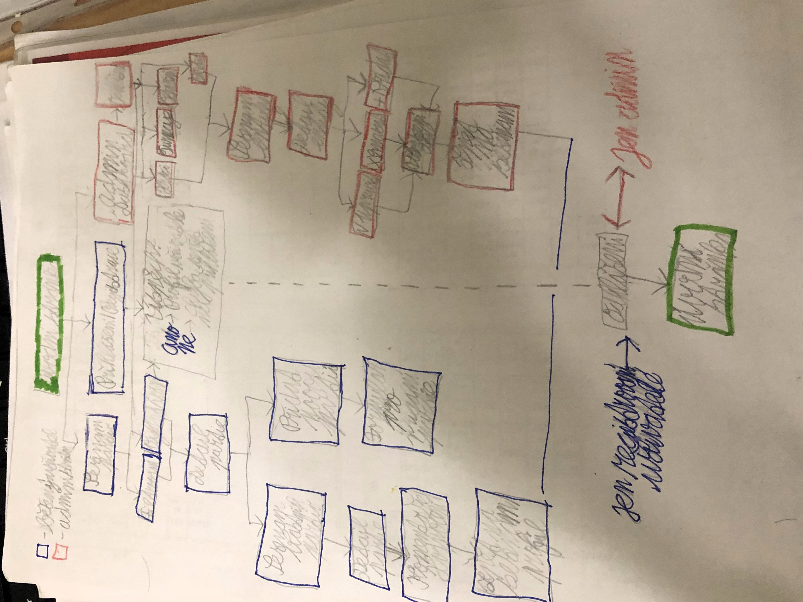
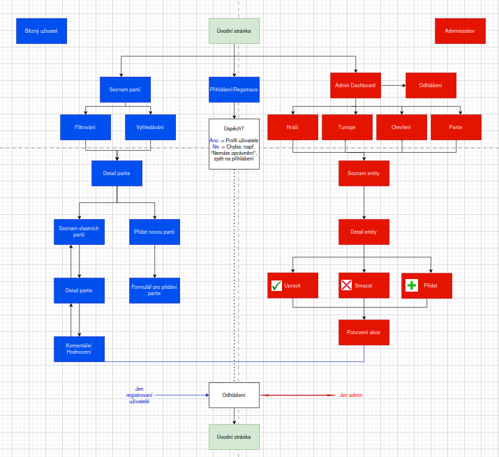
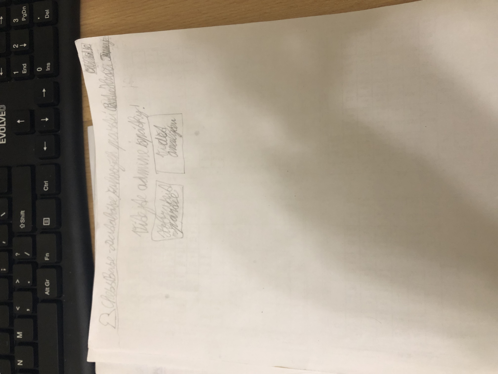
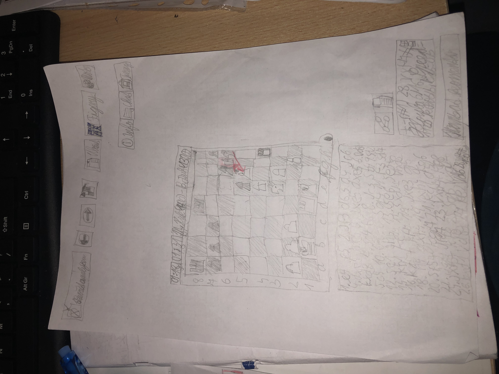

# Webová aplikace
Vznikla v předmětu Webové technologie na Gymnáziu Arabská ve školním roce 2025/2026.

## Local development

Aplikace používá Python Virtual Environment, před spuštěním je potřeba vytvořit venv (pokud neexistuje):

```bash
# Linux
python3 -m venv venv

# Windows
py -3 -m venv venv
```

Dále je třeba venv aktivovat:

```bash
# [Linux]
source ./venv/bin/activate

# Windows - Bash
source ./venv/Scripts/activate

# Windows - Power shell
.\venv\Scripts\Activate.ps1
```


Je třeba ujistit se, že jsou nainstalovány všechny závislosti:

```bash
# (venv)$
pip install -r requirements.txt
```


# ♟️ ChessBase – Databáze šachových partií

Autor: Viktor Meca

Předmět: Webové technologie

Fáze projektu: Analýza a Design

ChessBase je webová aplikace vytvořená v Django frameworku, která slouží jako databáze šachových partií. 
Uživatelé budou moci ukládat, vyhledávat a filtrovat šachové partie podle hráčů, roku, turnaje, výsledku 
nebo otevření.

Cílem projektu je vytvořit přehledný systém pro správu šachových dat s využitím relační databáze. 
Aplikace bude obsahovat modely jako Hráč, Partie a Turnaj, mezi kterými budou definovány vztahy 
(ForeignKey a případně ManyToMany).

Součástí projektu bude:
- přehled seznamu partií
- detail partie s informacemi o hráčích a výsledku
- možnost přidávání a úprav záznamů
- filtrování a vyhledávání
- moderní responzivní design pomocí Bootstrapu

Projekt bude dále rozšířen o autentizaci uživatelů a administrátorské rozhraní.

# Odborný článek k projektu

Webová aplikace ChessBase je databázový systém určený pro evidenci a správu šachových partií. Cílem projektu je vytvořit přehlednou webovou aplikaci, která umožní ukládání, vyhledávání a filtrování historických i vlastních partií podle různých kritérií.

Základními entitami systému jsou Hráč, Partie, Turnaj, Otevření a Uživatel. Každá partie obsahuje informace o bílém a černém hráči, datu sehrání, výsledku (1–0, 0–1, ½–½), typu zahájení a kompletním zápisu ve formátu PGN. Partie je vždy přiřazena ke konkrétnímu turnaji, který obsahuje název, místo konání a rok. Otevření je klasifikováno pomocí ECO kódu a názvu varianty.

Databázová struktura využívá relační model. Model Partie obsahuje cizí klíče (ForeignKey) na modely Hráč, Turnaj a Otevření. Každý uživatel může přidávat nové partie a upravovat své vlastní záznamy. Administrátor má plná práva spravovat všechny databázové entity.

Systém rozlišuje tři role:

Anonymní návštěvník – může prohlížet seznam partií, zobrazovat detail partie a využívat filtrování.

Registrovaný uživatel – může přidávat nové partie, upravovat své záznamy a přidávat komentáře.

Administrátor – spravuje hráče, turnaje, otevření i partie.

Aplikace bude implementována pomocí frameworku Django s využitím relační databáze (SQLite/PostgreSQL). Uživatelské rozhraní bude navrženo metodikou mobile-first a stylováno pomocí Bootstrapu. Součástí systému bude autentizace, formuláře pro práci s databází a pokročilé filtrování dat.

Hlavním přínosem aplikace je systematizace šachových dat a možnost jejich efektivního vyhledávání a analýzy.

## User Flow Diagram




## Wifeframes






